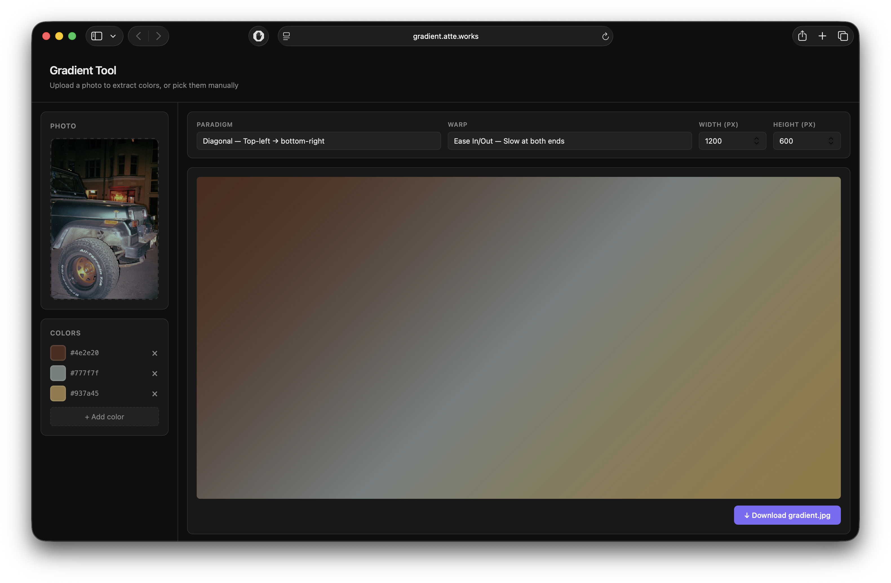
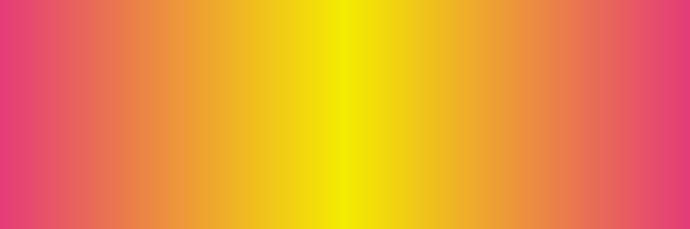

# Gradient Tool

Extract colors from a photo — or pick them by hand — and render them into a gradient image. Built with a Rust backend and a React frontend.

**Live demo → [gradient.atte.works](https://gradient.atte.works)**

---

## How it works

Upload a photo and the API clusters its pixels in perceptually-uniform Lab color space to find the dominant colors. Those colors are rendered into a gradient JPEG you can download.

### Source photo

<p align="center">
  
</p>

### Extracted gradients

<p align="center">
  
  <br/><em>Linear — straight interpolation</em>
</p>

<p align="center">
  
  <br/><em>Radial — circle expanding from center</em>
</p>

---

## Features

- **Photo upload** — drag & drop a JPEG or PNG, get back 5 dominant colors
- **Manual color picker** — add, remove, and reorder colors freely
- **Color presets** — Sunset, Ocean, Forest, Neon, Monochrome, Candy
- **5 gradient styles** — linear, diagonal, radial, reflected, free
- **Draggable color points** — drag each color's handle directly on the preview image
- **Free style** — place color centers anywhere; blended by inverse-distance weighting
- **Noise** — baked film grain in the rendered JPEG, adjustable 0–100%
- **Live preview** — gradient re-renders 250 ms after any change
- **Download** — full-resolution JPEG straight from the API

---

## Stack

| Layer | Tech |
|---|---|
| API | Rust · Axum · Tokio |
| Color extraction | k-means clustering in Lab color space (`kmeans_colors`) |
| Image decode/encode | `image` crate |
| Frontend | React 18 · TypeScript · Vite · pnpm |
| Hosting | Fly.io |

---

## API

### `POST /api/gradient/render`

```json
{
  "stops": [
    { "hex": "#e8534a", "position": 0.0 },
    { "hex": "#f0a500", "position": 0.5 },
    { "hex": "#4a90d9", "position": 1.0 }
  ],
  "width": 1200,
  "height": 160,
  "paradigm": "radial",
  "noise": 0.05
}
```

For `free` paradigm, include `x` and `y` (normalized 0–1) on each stop instead of `position`:

```json
{
  "stops": [
    { "hex": "#e8534a", "x": 0.2, "y": 0.3, "position": 0 },
    { "hex": "#4a90d9", "x": 0.8, "y": 0.7, "position": 0 }
  ],
  "paradigm": "free",
  "width": 1200,
  "height": 800
}
```

Returns an `image/jpeg` binary.

**Paradigms:** `linear` · `diagonal` · `radial` · `reflected` · `free`

### `POST /api/gradient/from-colors`

```json
{
  "colors": ["#e8534a", "#f0a500", "#4a90d9"],
  "steps": 10
}
```

### `POST /api/image/extract-colors`

Multipart upload with field `image` (JPEG or PNG, max 10 MB). Returns dominant colors and a gradient.

---

## Running locally

```bash
# Terminal 1 — API (port 3000)
cargo run -p api

# Terminal 2 — Frontend dev server (port 5173)
cd frontend && pnpm install && pnpm run dev
```

Open **http://localhost:5173**

To test the production build locally:

```bash
cd frontend && pnpm run build && cd ..
cargo run -p api
# open http://localhost:3000
```

### Shell script demo

```bash
./demo.sh photo.jpg                 # linear, no noise
./demo.sh photo.jpg -p radial       # radial
./demo.sh photo.jpg -p diagonal     # diagonal
```
